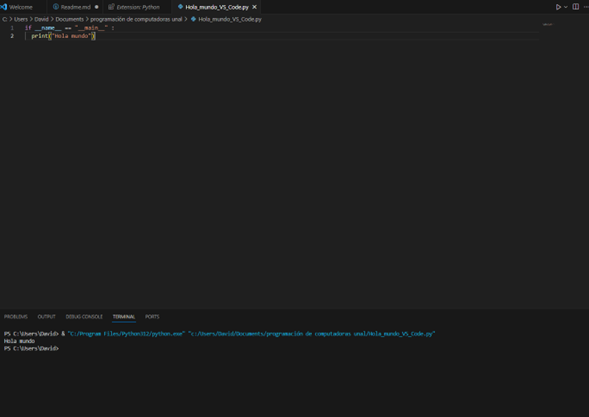
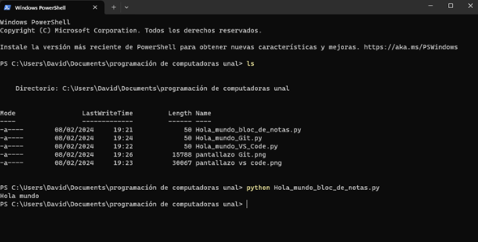
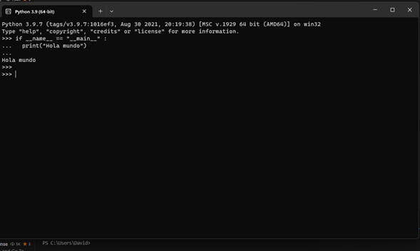
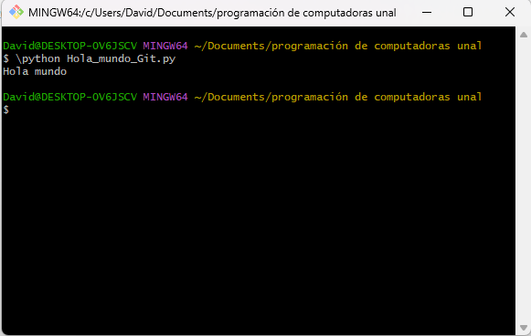

# Reto 2 programación de computadoras grupo 5
### -David Alejandro Montes Rodríguez

El reto 2 consiste en la ejecución del siguiente código:

` if __name__ == "__main__" :
  print("Hola mundo")`

  en la terminal de python, VS Code y la terminal de windows.

(adicionalmente la creación de este Readme.md para la documentación)

a continuación se presentan los tres pantallazos:

VS Code

Pantallazo terminal de Windows

Pantallazo terminal de python:

Adicionalmente también elegí probar a ejecutarlo en Git:

-fin